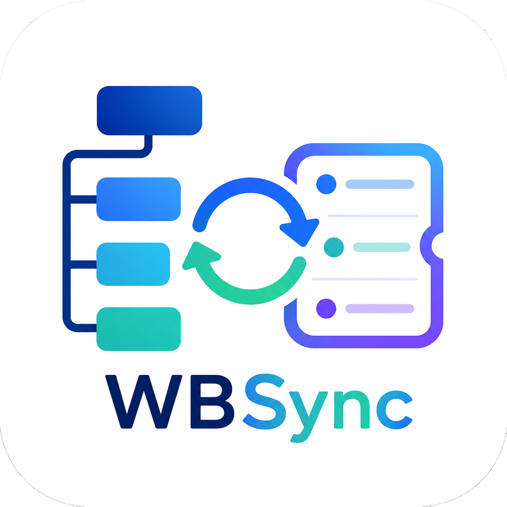

<p align="center">
  
</p>

<h1 align="center">WBSync</h1>

<p align="center">
  WBS、チケット管理、ガントチャートをひとつにまとめた Windows 向けローカルプロジェクト管理ツール。
</p>

WBSync は、Excelや複数ツールに散らばりやすい工程管理を、ひとつのデスクトップアプリで扱うための軽量ツールです。  
WBSを作り、チケットを紐付け、ガントチャートで期間を確認し、必要なタイミングでCSVへ出力できます。

## Features

- WBS作成: 親子階層、担当、状態、開始日、終了日、進捗率、メモを管理
- チケット管理: Kanban形式で未対応、対応中、レビュー、完了、保留を整理
- ガントチャート: WBSの期間と進捗を横断的に表示
- CSV出力: WBS、チケット、ガント用データをまとめて出力
- ローカル保存: プロジェクトデータは手元のJSONファイルに保存
- 単体EXE: Python環境なしで起動できる `WBSync.exe` を生成可能

## Who It Is For

- 小規模プロジェクトのWBSと課題を手早く整理したい人
- Excel管理から少しだけ脱出したいチーム
- ガントとチケットを別々のツールで管理したくない人
- オフラインでも使えるWindowsデスクトップツールがほしい人

## Quick Start

Pythonで起動:

```powershell
python .\wbsync.py
```

Windows EXEを作成:

```powershell
.\build_exe.ps1
```

生成される実行ファイル:

```text
dist\WBSync.exe
```

## Project Structure

```text
.
├─ assets/
│  ├─ brand/          # ロゴや元アイコン
│  └─ generated/      # EXE/ウィンドウ用に生成したアイコン
├─ docs/
│  ├─ marketing/      # 告知文、紹介文、投稿テンプレート
│  └─ screenshots/    # READMEやSNS用スクリーンショット置き場
├─ src/wbsync/        # アプリ本体
├─ scripts/           # ローカル整理用スクリプト
├─ tools/             # アイコン生成などの補助ツール
├─ build_exe.ps1      # Windows向け単体EXEビルド
└─ wbsync.py          # 開発時の起動入口
```

## Data And Export

プロジェクトデータは実行ファイルと同じフォルダの `wbsync_project.json` に保存されます。  
CSV出力では以下のファイルを生成できます。

- `wbs_YYYYMMDD_HHMMSS.csv`
- `tickets_YYYYMMDD_HHMMSS.csv`
- `gantt_YYYYMMDD_HHMMSS.csv`

## Build Notes

ビルド時に `assets/brand/Icon.png` から `assets/generated/icon.ico` とウィンドウ用の小サイズPNGを生成します。  
PyInstallerで `--icon` を指定しているため、Explorerに表示されるEXEアイコンにも反映されます。

## Documentation

- [使い方](docs/USAGE.md)
- [ロードマップ](docs/ROADMAP.md)
- [公開前チェックリスト](docs/PUBLISHING_CHECKLIST.md)

